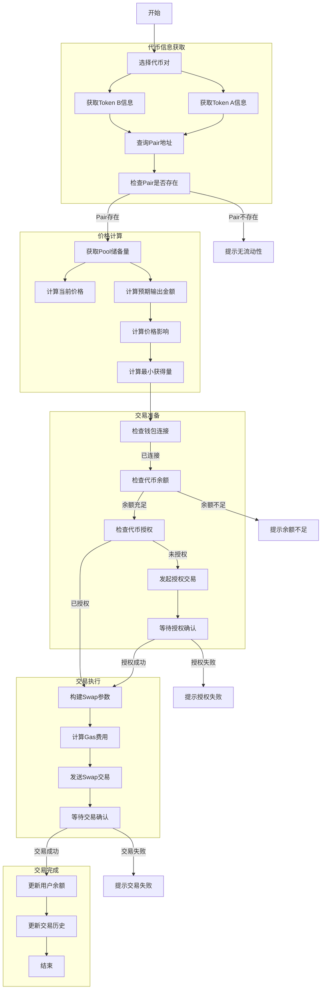

## 核心流程图

```mermaid
flowchart TD
    A[开始] --> B[选择代币对]
    
    subgraph 代币信息获取
        B --> C1[获取Token A信息]
        B --> C2[获取Token B信息]
        C1 --> D[查询Pair地址]
        C2 --> D
        D --> E[检查Pair是否存在]
    end
    
    subgraph 价格计算
        E -->|Pair存在| F[获取Pool储备量]
        F --> G1[计算当前价格]
        F --> G2[计算预期输出金额]
        G2 --> H[计算价格影响]
        H --> I[计算最小获得量]
    end
    
    subgraph 交易准备
        I --> J[检查钱包连接]
        J -->|已连接| K[检查代币余额]
        K -->|余额充足| L[检查代币授权]
        L -->|未授权| M[发起授权交易]
        M --> N[等待授权确认]
    end
    
    subgraph 交易执行
        N -->|授权成功| O[构建Swap参数]
        L -->|已授权| O
        O --> P[计算Gas费用]
        P --> Q[发送Swap交易]
        Q --> R[等待交易确认]
    end
    
    subgraph 交易完成
        R -->|交易成功| S[更新用户余额]
        S --> T[更新交易历史]
        T --> U[结束]
    end

    %% 错误处理分支
    E -->|Pair不存在| V[提示无流动性]
    K -->|余额不足| W[提示余额不足]
    N -->|授权失败| X[提示授权失败]
    R -->|交易失败| Y[提示交易失败]

    %% 样式
    style A fill:#
```
